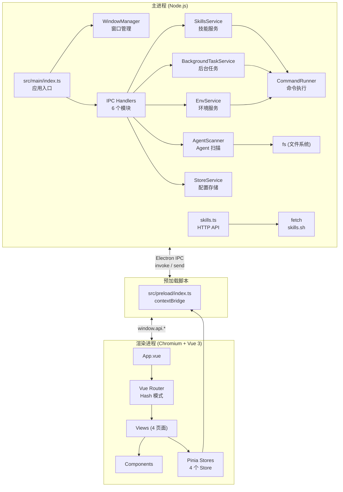
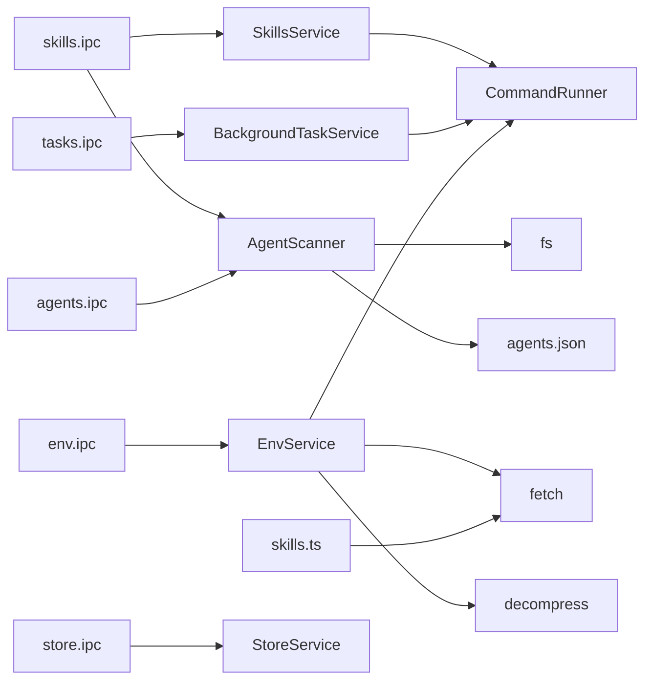
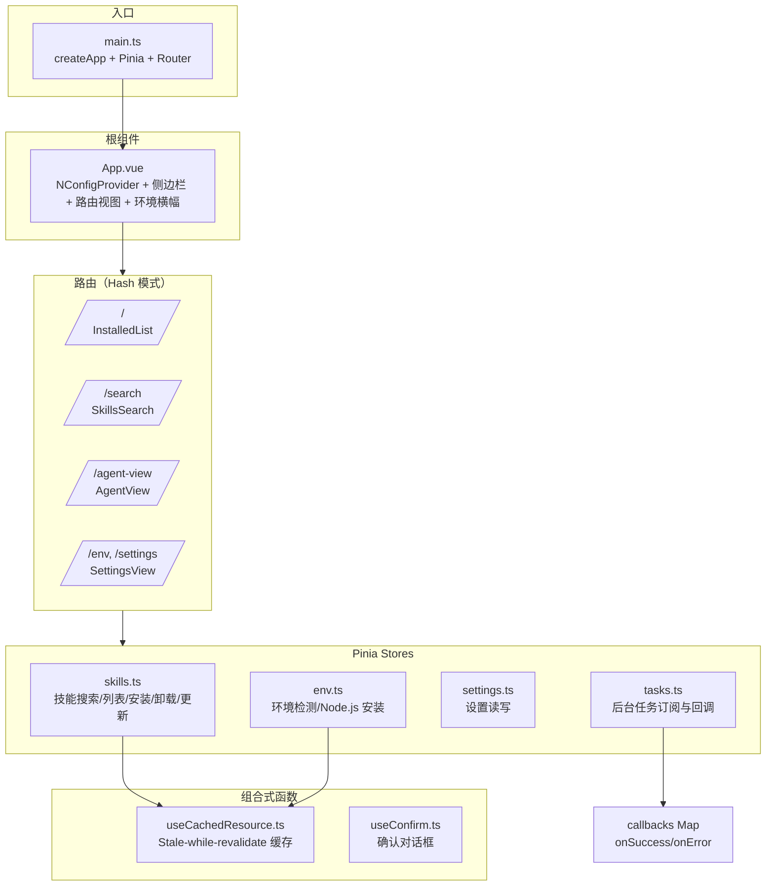
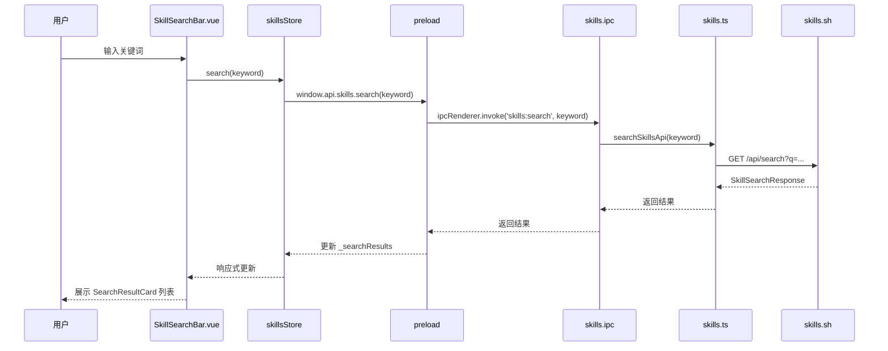
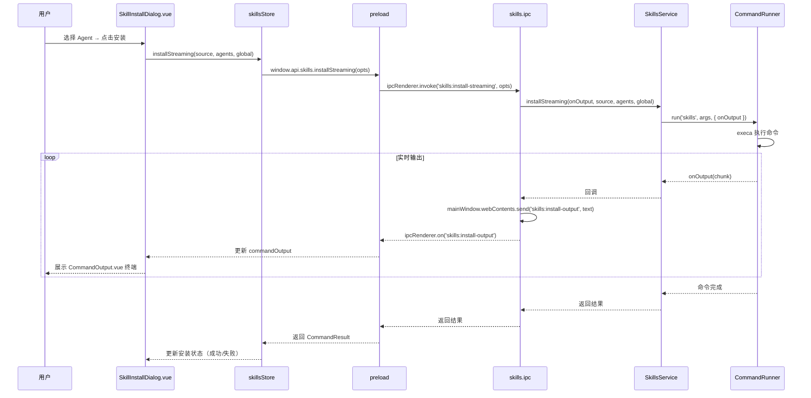
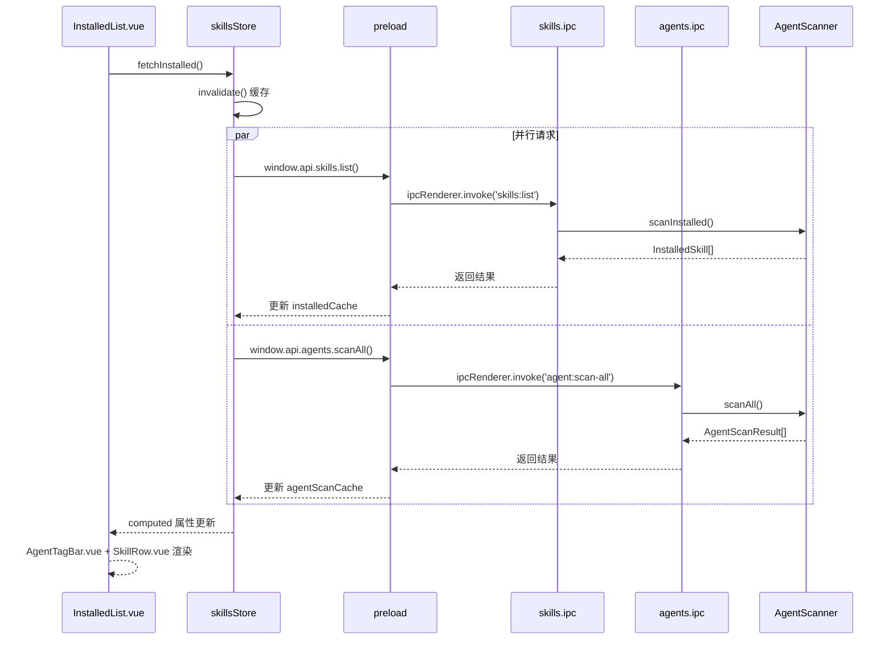
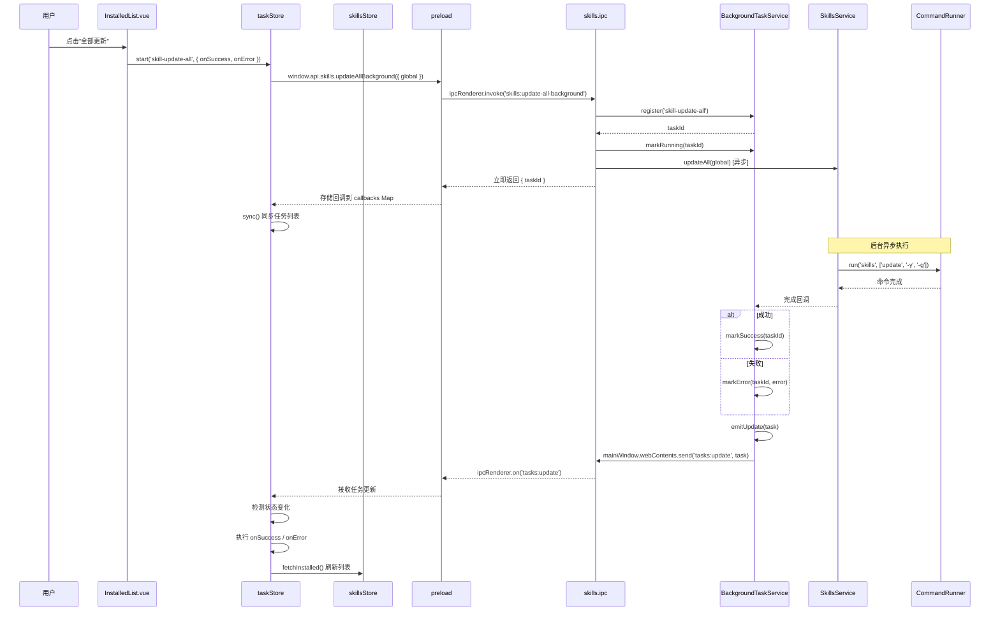
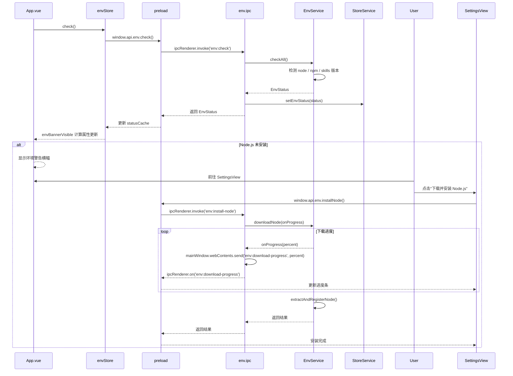

# NPX Skills UI — 软件架构文档

## 1. 项目概述

**NPX Skills UI** 是一个基于 Electron 的桌面应用，为 [`npx skills`](https://github.com/vercel-labs/skills) CLI 提供图形化管理界面。它支持对 55+ 种 AI 编码助手（如 Claude Code、Cursor、GitHub Copilot 等）的技能包（skills）进行搜索、安装、更新和卸载。

### 1.1 技术栈

| 层级      | 技术                                   |
| --------- | -------------------------------------- |
| 主进程    | Electron 39 + Node.js + TypeScript 5.9 |
| 构建工具  | electron-vite 5                        |
| 渲染进程  | Vue 3.5 + TypeScript 5.9               |
| 状态管理  | Pinia 3                                |
| UI 组件库 | Naive UI 2.44                          |
| 命令执行  | execa                                  |
| 存储      | electron-store                         |

### 1.2 核心功能

- **技能搜索**：通过 `skills.sh` API 搜索社区技能包
- **技能管理**：安装、更新、卸载技能到指定 AI Agent
- **Agent 扫描**：自动检测各 AI Agent 已安装的技能
- **环境检测与修复**：自动检测 Node.js / npm / skills CLI，支持一键安装
- **后台任务**：批量更新等长时间操作支持后台执行
- **网络优化**：内置 GitHub 代理与 npm 镜像源配置

---

## 2. 目录结构

```
NPX Skills UI
├── src/
│   ├── main/                          # Electron 主进程（Node.js）
│   │   ├── index.ts                   # 应用生命周期、窗口创建、IPC 注册
│   │   ├── services/                  # 主进程业务逻辑（单例服务）
│   │   │   ├── CommandRunner.ts       # execa 封装：流式输出、超时、取消
│   │   │   ├── SkillsService.ts       # 所有 `npx skills` CLI 交互
│   │   │   ├── AgentScanner.ts        # 文件系统扫描 Agent 技能目录
│   │   │   ├── EnvService.ts          # Node.js 检测、下载、解压、注册
│   │   │   ├── StoreService.ts        # electron-store 配置持久化
│   │   │   ├── BackgroundTaskService.ts # 后台任务生命周期管理
│   │   │   └── WindowManager.ts       # 多窗口管理（主窗口 + 设置窗口）
│   │   ├── api/
│   │   │   └── skills.ts              # HTTP 客户端：skills.sh 搜索 API
│   │   └── ipc/                       # IPC 处理器模块
│   │       ├── index.ts               # 集中注册 + 错误序列化
│   │       ├── skills.ipc.ts          # 技能 CRUD + 流式安装
│   │       ├── agents.ipc.ts          # Agent 扫描
│   │       ├── env.ipc.ts             # 环境检测与 Node.js 安装
│   │       ├── store.ipc.ts           # 设置读写
│   │       └── tasks.ipc.ts           # 后台任务生命周期
│   ├── preload/                       # 预加载脚本（contextBridge）
│   │   ├── index.ts                   # 暴露 window.api.* 的 IPC 方法
│   │   └── index.d.ts                 # TypeScript 类型声明
│   ├── renderer/                      # 渲染进程（Vue 3 SPA）
│   │   ├── index.html
│   │   └── src/
│   │       ├── main.ts                # Vue 应用入口
│   │       ├── App.vue                # 根组件：主题、侧边栏、路由视图
│   │       ├── router/
│   │       │   └── index.ts           # Hash 路由（5 条路由）
│   │       ├── views/                 # 页面组件
│   │       │   ├── InstalledList.vue   # / — 已安装技能列表
│   │       │   ├── SkillsSearch.vue    # /search — 技能搜索
│   │       │   ├── AgentView.vue       # /agent-view — Agent 管理
│   │       │   └── SettingsView.vue    # /env, /settings — 设置与环境
│   │       ├── components/            # 可复用组件
│   │       │   ├── layout/
│   │       │   │   └── AppSidebar.vue
│   │       │   ├── skills/
│   │       │   │   ├── SkillSearchBar.vue
│   │       │   │   ├── SearchResultCard.vue
│   │       │   │   ├── SkillInstallDialog.vue
│   │       │   │   ├── SkillRow.vue
│   │       │   │   ├── AgentTagBar.vue
│   │       │   │   ├── AgentFilter.vue
│   │       │   │   └── SkillRemoveDialog.vue
│   │       │   └── common/
│   │       │       └── CommandOutput.vue
│   │       ├── stores/                # Pinia 状态管理
│   │       │   ├── skills.ts          # 技能状态、搜索、安装/卸载/更新
│   │       │   ├── env.ts             # 环境状态、Node.js 安装
│   │       │   ├── tasks.ts           # 后台任务订阅
│   │       │   └── settings.ts        # 应用设置持久化
│   │       ├── composables/           # 组合式函数
│   │       │   ├── useCachedResource.ts # 缓存异步数据（Stale-while-revalidate）
│   │       │   └── useConfirm.ts      # 确认对话框
│   │       ├── constants/
│   │       │   └── agents.ts          # Agent 定义（从 shared/agents.json 导入）
│   │       └── assets/                # 样式资源
│   │           ├── tokens.css         # 设计令牌（颜色、间距、字体、圆角）
│   │           ├── main.css           # 重置、字体（DM Sans）、令牌导入
│   │           ├── base.css           # 基础动画
│   │           └── card.css           # 卡片基础样式与悬浮提升
│   └── shared/                        # 共享代码（主进程 + 渲染进程共用）
│       ├── types.ts                   # 核心接口与工具函数
│       └── agents.json                # Agent 注册表：名称、标识、路径配置
├── package.json
├── electron.vite.config.ts            # electron-vite 构建配置
├── tsconfig.json                      # TypeScript 配置
├── tsconfig.node.json
├── tsconfig.web.json
├── eslint.config.mjs
└── prettier.config.mjs
```

---

## 3. 整体架构

NPX Skills UI 采用 Electron 标准的三进程架构，配合 **electron-vite** 实现主进程与渲染进程的独立构建。



---

## 4. 核心模块详解

### 4.1 主进程服务层（Services）

主进程的 Services 目录包含 6 个单例服务，封装所有与操作系统和外部工具的交互：

| 服务                      | 文件                       | 职责                                                                                                                                   |
| ------------------------- | -------------------------- | -------------------------------------------------------------------------------------------------------------------------------------- |
| **CommandRunner**         | `CommandRunner.ts`         | 封装 `execa` 执行系统命令，支持流式输出回调、超时控制（默认 60s）、取消执行、ANSI 转义码过滤。Windows 平台自动启用 `shell: true`。     |
| **SkillsService**         | `SkillsService.ts`         | 封装 `skills` CLI 的所有操作：安装、流式安装、更新、更新全部、卸载。支持 GitHub 代理地址替换。                                         |
| **AgentScanner**          | `AgentScanner.ts`          | 读取 `shared/agents.json` 中的 55+ Agent 配置，扫描各 Agent `globalPath` 目录下的技能文件夹，聚合出按技能名分组的已安装技能列表。      |
| **EnvService**            | `EnvService.ts`            | 检测 Node.js / npm / skills CLI 的安装状态；支持下载指定版本 Node.js（v20.18.0）、解压并自动注册到 `PATH`；支持安装 skills CLI。       |
| **BackgroundTaskService** | `BackgroundTaskService.ts` | 管理长时间运行的后台任务（如批量更新），维护任务状态（pending/running/success/error/cancelled），通过 IPC 向渲染进程实时推送状态变更。 |
| **StoreService**          | `StoreService.ts`          | 基于 `electron-store` 持久化应用设置和环境状态。初始化失败时回退到内存存储。                                                           |
| **WindowManager**         | `WindowManager.ts`         | 管理主窗口（1200x800）和设置窗口（600x500，子窗口）。开发模式加载 `ELECTRON_RENDERER_URL`，生产模式加载本地 HTML。                     |

#### 服务依赖关系



### 4.2 IPC 通信层

IPC 是主进程与渲染进程之间的唯一通信桥梁，分为两种模式：

| 模式              | 方向                       | 说明                                                 |
| ----------------- | -------------------------- | ---------------------------------------------------- |
| **Invoke/Handle** | Renderer → Main → Renderer | 请求-响应模式，适用于搜索、安装、获取列表等操作      |
| **Send/On**       | Main → Renderer            | 事件推送模式，适用于流式输出、下载进度、任务状态更新 |

#### IPC 通道清单

```mermaid
graph LR
    subgraph Invoke["Invoke / Handle"]
        I1["skills:search"]
        I2["skills:list"]
        I3["skills:install"]
        I4["skills:install-streaming"]
        I5["skills:install-cancel"]
        I6["skills:update"]
        I7["skills:update-all"]
        I8["skills:remove"]
        I9["skills:update-background"]
        I10["skills:update-all-background"]
        I11["agent:scan-all"]
        I12["agent:scan-one"]
        I13["env:check"]
        I14["env:install-node"]
        I15["env:install-skills"]
        I16["env:cancel-install-node"]
        I17["store:get-settings"]
        I18["store:set-settings"]
        I19["tasks:start"]
        I20["tasks:cancel"]
        I21["tasks:get-all"]
        I22["shell:open-path"]
        I23["window:open-settings"]
    end

    subgraph Send["Send / On"]
        S1["skills:install-output<br/>Main → Renderer"]
        S2["env:download-progress<br/>Main → Renderer"]
        S3["tasks:update<br/>Main → Renderer"]
    end
```



### 4.3 渲染进程（Vue 3 SPA）

渲染进程采用标准的 Vue 3 单页应用架构：



### 4.4 共享层（Shared）

`src/shared/` 目录下的代码同时被主进程和渲染进程引用，确保两端类型一致：

| 文件          | 内容                                                                                                                                                                                                                                         |
| ------------- | -------------------------------------------------------------------------------------------------------------------------------------------------------------------------------------------------------------------------------------------- |
| `types.ts`    | 所有核心接口：`EnvStatus`、`Skill`、`InstalledSkill`、`AgentScanResult`、`BackgroundTask`、`CommandResult`、`CommandErrorInfo`、`AppSettings`、`SkillSearchResult`、`SkillSearchResponse`，以及工具函数 `toPackageRef()`、`formatInstalls()` |
| `agents.json` | 55+ AI Agent 的注册配置：名称、`agentFlag`、项目级路径、全局路径（`~` 表示用户主目录）                                                                                                                                                       |

---

## 5. 关键数据流

### 5.1 技能搜索流程



### 5.2 技能流式安装流程



### 5.3 已安装技能列表加载流程



### 5.4 后台任务流程（以"更新全部技能"为例）



### 5.5 环境检测与 Node.js 安装流程



---

## 6. 核心类型定义

以下类型定义来自 `src/shared/types.ts`，是理解数据模型的关键：

### 6.1 环境与配置

```typescript
interface EnvStatus {
  nodeInstalled: boolean
  nodeVersion: string | null
  npmInstalled: boolean
  npmVersion: string | null
  skillsInstalled: boolean
  skillsVersion: string | null
}

interface AppSettings {
  defaultAgent: string
  autoCheckEnv: boolean
  proxyUrl?: string
  npmRegistry?: string
}
```

### 6.2 技能相关

```typescript
interface Skill {
  name: string
  version: string
  source: string
  path: string
  scope: 'global' | 'project'
  agents: string[]
}

interface InstalledSkillAgent {
  name: string
  path: string
}

interface InstalledSkill {
  name: string
  agents: InstalledSkillAgent[]
}

interface AgentScanResult {
  agentFlag: string
  agentName: string
  globalPath: string
  skills: string[]
  count: number
}
```

### 6.3 命令执行与任务

```typescript
interface CommandResult {
  success: boolean
  stdout: string
  stderr: string
  exitCode: number | null
}

interface CommandErrorInfo {
  code: 'COMMAND_NOT_FOUND' | 'TIMEOUT' | 'EXECUTION_FAILED' | 'UNKNOWN'
  command: string
  stderr: string
  exitCode: number | null
  message: string
}

interface BackgroundTask {
  id: string
  type: 'update-skills' | 'install-node' | 'install-skills'
  status: 'pending' | 'running' | 'success' | 'error' | 'cancelled'
  progress: number
  stdout: string
  error?: string
  createdAt: number
  updatedAt: number
}
```

### 6.4 搜索 API

```typescript
interface SkillSearchResult {
  id: string
  skillId: string
  name: string
  installs: number
  source: string
}

interface SkillSearchResponse {
  query: string
  searchType: string
  skills: SkillSearchResult[]
  count: number
  duration_ms: number
}
```

---

## 7. 设计模式与亮点

### 7.1 Stale-while-revalidate 缓存

`useCachedResource<T>` 组合式函数为所有 Pinia Store 的数据获取提供缓存能力：

- **`ensure()`** — 有有效缓存时直接返回，否则发起请求
- **`refresh()`** — 强制刷新，无视缓存
- **`invalidate()`** — 标记缓存过期，下次 `ensure()` 会重新获取

应用场景：已安装技能列表、Agent 扫描结果、环境状态。

### 7.2 后台任务系统

`BackgroundTaskService` 将长时间操作（批量更新、CLI 安装）从用户交互线程中解耦：

- 任务注册后立即返回 `taskId`，不阻塞 UI
- 主进程异步执行，通过 `tasks:update` IPC 事件推送状态变更
- 渲染进程的 `taskStore` 通过 `callbacks` Map 管理每个任务的 `onSuccess` / `onError` 回调
- 自动清理：已完成任务超过 50 个时删除旧任务

### 7.3 流式输出

技能安装过程中，命令的 stdout/stderr 通过 `onOutput` 回调实时推送到渲染进程：

1. `CommandRunner` 通过 execa 的 `stdout.on('data')` 获取输出片段
2. `SkillsService` 的 `onOutput` 回调将片段传递给 IPC Handler
3. IPC Handler 通过 `mainWindow.webContents.send('skills:install-output', text)` 推送
4. 渲染进程通过 `window.api.skills.onInstallOutput()` 接收并展示在 `CommandOutput.vue` 终端组件中

### 7.4 错误序列化

所有 IPC 错误统一通过 `CommandErrorInfo` 结构序列化，确保跨进程传输时保留完整的错误上下文（错误码、命令、stderr、退出码）。

### 7.5 设计系统

- **CSS 设计令牌**：`tokens.css` 统一管理颜色、间距、字体、圆角、阴影
- **字体**：DM Sans
- **圆角体系**：按钮全圆角（`9999px`），卡片大圆角（`16px`），输入框圆角（`8px`）
- **卡片样式**：`card.css` 提供 `.card-base` 类，内置悬浮提升阴影过渡

---

## 8. 路由映射

| 路径                 | 名称           | 组件                | 说明                                                |
| -------------------- | -------------- | ------------------- | --------------------------------------------------- |
| `/`                  | `installed`    | `InstalledList.vue` | 已安装技能列表（首页）                              |
| `/search`            | `search`       | `SkillsSearch.vue`  | 技能搜索                                            |
| `/agent-view`        | `agent-view`   | `AgentView.vue`     | Agent 管理（卡片网格 + 抽屉详情）                   |
| `/env`               | `env`          | `SettingsView.vue`  | 环境检测与修复                                      |
| `/settings`          | `settings`     | `SettingsView.vue`  | 应用设置（别名路由）                                |

> 使用 `createWebHashHistory()` 以兼容 Electron 的 `file://` 协议。

---

## 9. 构建与开发

| 命令                  | 说明                            |
| --------------------- | ------------------------------- |
| `npm install`         | 安装依赖                        |
| `npm run dev`         | 开发服务器（热重载，端口 7456） |
| `npm run build`       | 类型检查 + 生产构建             |
| `npm run typecheck`   | 运行 node 和 web 类型检查       |
| `npm run lint`        | ESLint 检查                     |
| `npm run format`      | Prettier 格式化                 |
| `npm run build:win`   | 构建 Windows NSIS 安装包        |
| `npm run build:mac`   | 构建 macOS DMG                  |
| `npm run build:linux` | 构建 Linux AppImage/deb         |
